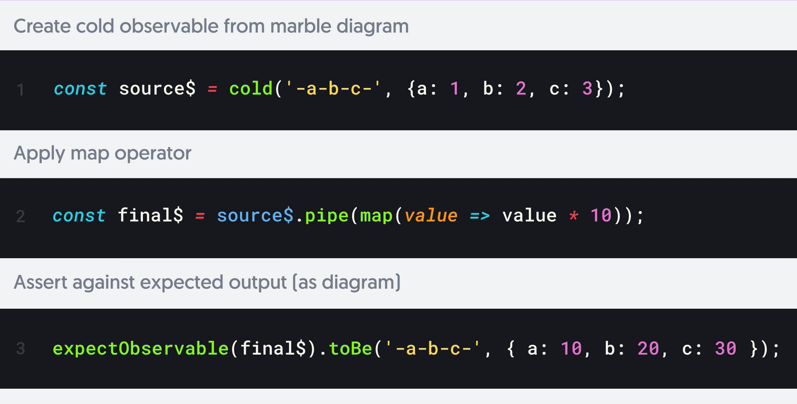

# TechTalk: RxJS Marbles Testing 

*Notice: If you have any propositions feel free to make an issue or create a pull request.*


* `-` each dash represents a frame of virtual time
* `[a-z][0-9]` represents emitted values, ex. `-a--b-`
* `#` represents errors, ex. `-a--b-#`
* `()` represents synchronous groupings, ex. `-(abc)---`
* `|` represents completion, ex. `(abc|)`



### Quick Start

```bash
git clone git@github.com:korniychuk/tech-talk_rxjs-testing_1.git
cd tech-talk_rxjs-testing_1
yarn install
```

## How to run tests

### Wallaby JS

* Wallaby JS works out of the box without any additional config  
  Notice: How to run in "Without Configuration" mode ([Official Wallaby JS Guide](https://wallabyjs.com/docs/intro/config.html#automatic-configuration))

### Jest

* All tests

  `npm run test`  
  `npm run test:watch`

* Specific tests

  `npm run test -- src/my.spec.ts`  
  `npm run test:watch -- src/my.spec.ts`

## How to run lint

* Just show problems `npm run lint`
* Fix problems if it is possible `npm run lint:fix`

## Info

### Marbles vs Subscribe & assert pros/cons

**Marble testing:**  

✅ Expressive tests using marbles  
✅ More easily create & visualize streams  
✅ Test accuracy of values & timing  

❌ Fair amount of setup (resolved via `rxjs-marbles`)  
❌ Req. knowledge of RxJS Testing helpers  
❌ Req. knowledge of marble syntax  

**Subscribe and assert testing:**  

✅ Less setup required  
✅ Use typical testing APIs  
✅ Use typical testing patterns  

❌ Must manage async test completion  
❌ Extra boilerplate for assertions  
❌ It is very difficult to test all behavioral branches  
❌ Some risk of write fake tests  

## Links

[ GitHub Repository](https://github.com/korniychuk/tech-talk_rxjs-testing_1)  

[ www.korniychuk.pro](https://www.korniychuk.pro)

## Author

| [<br /><sub>Anton Korniychuk</sub>](https://korniychuk.pro) |
| :---: |
